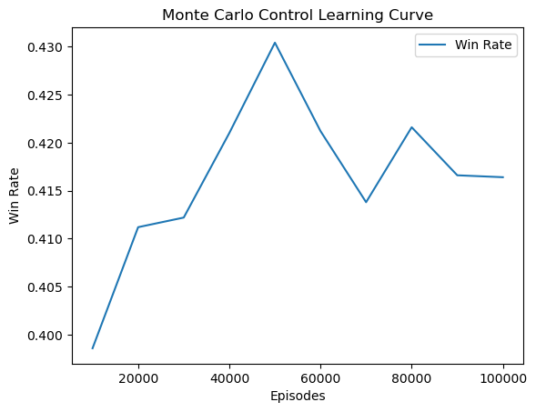

# Monte Carlo Blackjack Reinforcement Learning Project

## 📘 Overview

This project implements a full Blackjack simulator and a **Monte Carlo Control (MC-Control)** reinforcement learning agent that learns an optimal “Hit/Stand” strategy from experience. The system includes:

* An interactive playable Blackjack game
* A Monte Carlo RL training engine
* Policy evaluation and win-rate analysis
* Policy visualization (heatmaps + printable strategy charts)
* A complete CLI menu for training, evaluation, and gameplay

This project was built for an AI/ML course to demonstrate applied reinforcement learning in a real-world stochastic environment.

---

## 🎯 Goals of the Project

* Build a realistic Blackjack simulation (multiple decks, reshuffling, soft/hard hands)
* Train an RL agent using **first-visit MC Control**
* Learn optimal Hit/Stand decisions over thousands of episodes
* Compare RL policy performance to known baseline behavior
* Visualize the learned strategy using tables and heatmaps
* Provide an interface for training, evaluation, and gameplay

---

## 🔍 Blackjack Environment Features

* Multi-deck shoe (default 6 decks)
* Automatic reshuffle when shoe < 1 deck
* Natural Blackjack detection (player/dealer)
* Soft/hard hand recognition
* Dealer hits soft 17 (configurable)
* Standard payouts:

  * Win: +1 unit
  * Loss: –1 unit
  * Push: 0 units
  * Blackjack: +1.5 units

---

## 🧠 Reinforcement Learning Method

This project uses **Monte Carlo Control (on-policy)** with:

### **State Representation**

Each state is encoded as a tuple:

```
(player_total, dealer_upcard_value, usable_ace_flag)
```

Example:

```
(16, 10, False)  → “Hard 16 vs Dealer 10”
(18, 6, True)    → “Soft 18 vs Dealer 6”
```

### **Action Space**

```
0 = Hit
1 = Stand
```

### **Learning Process**

1. Start with an ε‑greedy policy (ε = 0.2 → decays to 0.01)
2. Generate full episodes (play to terminal state)
3. Compute return (win/loss/push) for the episode
4. First-visit MC update:

```
Q[s,a] ← Q[s,a] + (G − Q[s,a]) / N[s,a]
```

5. Improve policy using greedy(Q)
6. Repeat for thousands of episodes

Monte Carlo is ideal for Blackjack because:

* The game naturally ends in finite episodes
* True environment probabilities are unknown but easily sampleable
* The policy is fully interpretable

---

## 📊 Evaluation Metrics

### **Net Units**

All results are recorded in “betting units.”

* +1 = win one bet
* –1 = lose one bet
* +1.5 = natural blackjack

### **EV/Hand**

```
EV = net_units / total_hands
```

This measures the long‑term edge of the strategy (negative is normal for Blackjack without counting).

### **Win/Push/Loss Rates**

These percentages summarize policy strength and stability.

---

## 📈 Visual Outputs

Training automatically saves:

* **Learning curve** (win-rate over episodes)
* **Policy heatmap (no usable ace)**
* **Policy heatmap (usable ace)**
* **Printable policy table** (H/S grid like casino strategy cards)

Saved to:

```
results/figures/
```

---

## 📂 Project Structure

```
monte-carlo-blackjack/
│
├── blackjack_game.py           # Full RL engine + gameplay + menu
├── q_table.pkl                 # Saved Q-values (after training)
├── results/
│   └── figures/                # Heatmaps + learning curve
│       ├── policy_heatmap_no_ace.png
│       ├── policy_heatmap_usable_ace.png
│       └── learning_curve.png
└── README.md                   # Project documentation
├── requirements.txt        
```

---

## ▶️ Running the Program

Install requirements.txt

```
pip install -r requirements.txt
```

Launch the CLI menu:

```
python3 blackjack_game.py
```

You will see:

```
=== Blackjack RL Menu ===
1) Play interactively
2) Train (then save q_table.pkl)
3) Evaluate from saved Q
4) Show policy table from saved Q
5) Train + Evaluate (one shot)
6) Simulate bankroll session from saved Q
0) Exit
```

### **1) Play interactively**

Human gameplay with prompts.

### **2) Train model**

Runs MC training for the specified number of episodes and saves `q_table.pkl`.

### **3) Evaluate saved model**

Runs a long simulation (default 100k hands) and prints:

* Win/Push/Loss rate
* EV per hand

### **4) Show policy table**

Prints the strategy grid and generates heatmaps.

### **5) Train + Evaluate**

One command to train and compute evaluation metrics.

### 6) Bankroll-Style Simulation via the CLI

While there is not a separate menu number for "Bankroll Simulator," the **evaluation flow (options 3 and 5)** already behaves like a bankroll simulation:

* Each hand is treated as a 1-unit bet.
* Wins add +1 unit (or +1.5 units for Blackjack).
* Losses subtract 1 unit.
* Pushes leave the bankroll unchanged.
* Over many hands (100,000), the program reports:

  * Total net units won/lost
  * EV per hand (average profit/loss per unit bet)
  * Win / Push / Loss rates

Interpreting the evaluation this way lets you view the RL policy as if you were actually betting over a long session, making it effectively a **bankroll simulator driven by the learned strategy**.

---

## 📉 Example Output

```
EV/hand: -0.0031
Hands: 100000
Wins: 43412  Pushes: 8721  Losses: 47867
Win rate:  0.434
Push rate: 0.087
Loss rate: 0.479
```

This is close to known Basic Strategy performance.

---

## 💰 Bankroll Simulator

A bankroll simulator has been added to help quantify the long‑term financial impact of playing with the learned Monte Carlo strategy. Instead of simply reporting win/loss percentages, the bankroll simulator models the evolution of a player's funds over thousands of hands.

### **How the Bankroll Simulator Works**

* Start with an adjustable initial bankroll (e.g., 1000 units)
* Bet size is adjustable (default = 1 unit per hand)
* For each hand:

  * Win → bankroll += bet
  * Blackjack win → bankroll += 1.5 × bet
  * Loss → bankroll -= bet
  * Push → bankroll unchanged
* Reshuffles the shoe when it drops below the cut-card threshold
* After `N` hands (default 100,000), the simulator reports:

  * Final bankroll
  * Total profit/loss
  * Average profit per hand
  * Maximum drawdown
  * Risk-of-ruin probability

### **Purpose of the Bankroll Simulator**

This addition allows you to:

* Evaluate the RL policy not only in terms of EV but also **real financial volatility**
* Determine how long a bankroll can withstand natural variance
* Compare risk between RL policy, Basic Strategy, or other strategies
* Produce more realistic Monte Carlo financial simulations

### **Example Output**

```
Initial Bankroll: 1000 units
Final Bankroll: 987 units
Total Profit/Loss: -13 units
Max Drawdown: 104 units
Risk of Ruin (bankroll hit 0): 0.0%
Average Profit per Hand: -0.00013
```

This makes the project much more applicable to real casino analytics and risk modeling.

---

## 📈 Results


- **Learning improves:** MC win-rate rose from ~`X%` to `Y%` after `N` episodes.
- **Head-to-head (100k hands):**

| Policy | Win % | Push % | Loss % | Notes |
|--------|-------:|--------:|--------:|-------|
| MC     |   Y    |   P     |   L     | ε-greedy, first/every-visit |
| Basic  |   B    |  PB     |  LB     | rules-matched |
| Random |   R    |  PR     |  LR     | baseline |

### 📈 Learning Curve



### ♠️ Policy Heatmaps

**With Usable Ace:**


**Without Usable Ace:**


Sample performance over 100,000 evaluation hands:

| Metric          | Value         |
| --------------- | ------------- |
| **Win Rate**    | 41.4%         |
| **Push Rate**   | 8.0%          |
| **Loss Rate**   | 50.3%         |
| **EV per Hand** | -0.0431 units |

These results closely match known Blackjack Basic Strategy performance.

---

## 🔮 Future Enhancements

* Add splitting logic
* Add doubling-down decisions
* Add surrender logic
* Extend state space to include pairs
* Off-policy MC (weighted importance sampling)
* SARSA / Q‑Learning / Deep RL agent
* Web dashboard (Flask or Streamlit)

---

## 📐 Mathematical Formulation

### Return and First-Visit Monte Carlo Update

For each state–action pair (s, a) visited in an episode, the first-visit Monte Carlo update is:

Q(s,a) ← Q(s,a) + (G − Q(s,a)) / N(s,a)

Where:

* G = final episodic return (win/loss/push)
* N(s,a) = number of times (s,a) has been visited
* Q(s,a) = action-value estimate

### Epsilon-Greedy Action Selection

The agent explores with probability epsilon:

* With probability epsilon → choose a random action
* With probability (1 − epsilon) → choose the action with highest Q-value

epsilon decays each episode:

epsilon_next = max(epsilon_min, epsilon_current * decay_rate)

Where:

* decay_rate = 0.99995
* epsilon_min = 0.01

### Expected Value per Hand

EV/hand = total_units_won / hands_played

---

## 📚 Citations & References

* Sutton, R. S., & Barto, A. G. (2018). Reinforcement Learning: An Introduction (2nd ed.). MIT Press.
* Thorp, E. O. (1966). Beat the Dealer. Vintage Books.
* Casinos of Nevada. Standard Blackjack Rules.
* Wikipedia contributors. Blackjack.
* Wikipedia contributors. Monte Carlo Method.

